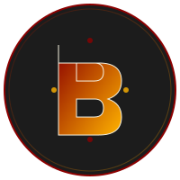
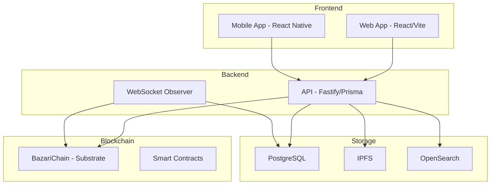

# 🌟 Bazari - Nação Digital Descentralizada

<div align="center">
  
  
  
  **Economia popular, democrática e sustentável através da blockchain**
  
  [](LICENSE)
  [](package.json)
  [](package.json)
  
</div>

## 📋 Índice

- [Visão Geral](#-visão-geral)
- [Arquitetura](#-arquitetura)
- [Começando](#-começando)
- [Estrutura do Projeto](#-estrutura-do-projeto)
- [Tecnologias](#-tecnologias)
- [Desenvolvimento](#-desenvolvimento)
- [Deployment](#-deployment)
- [Contribuindo](#-contribuindo)
- [Licença](#-licença)

## 🎯 Visão Geral

Bazari é um ecossistema descentralizado completo que combina blockchain, marketplace, governança DAO e ferramentas de desenvolvimento. Nossa missão é criar uma economia digital justa, transparente e acessível para todos.

### Características Principais

- **🔐 Carteira Nativa**: Gerencie BZR e LIVO sem extensões externas
- **🛍️ Marketplace**: Compre e venda produtos/serviços com cashback automático
- **👥 SubDAOs**: Crie e gerencie negócios descentralizados
- **⚡ Bazari Studio**: Gere sistemas completos sem código
- **💱 P2P & Câmbio**: Troque BZR por moedas fiduciárias
- **🌐 Rede Social**: Conecte-se com a comunidade

### Economia Justa

Cada transação no ecossistema tem split automático:
- **88%** → Vendedor/Operador
- **8%** → Tesouro da SubDAO
- **2%** → Validadores/Infraestrutura
- **2%** → Cashback LIVO

## 🏗️ Arquitetura



## 🚀 Começando

### Pré-requisitos

- Node.js >= 18.0.0
- pnpm >= 8.0.0
- Docker & Docker Compose
- Git

### Instalação

1. Clone o repositório:
```bash
git clone https://github.com/bazari/bazari.git
cd bazari
```

2. Instale as dependências:
```bash
pnpm install
```

3. Configure as variáveis de ambiente:
```bash
cp .env.example .env.local
# Edite .env.local com suas configurações
```

4. Inicie os serviços Docker (Postgres, IPFS, etc.):
```bash
docker-compose -f infra/docker-compose.dev.yml up -d
```

5. Execute as migrações do banco de dados:
```bash
pnpm -F @bazari/api prisma migrate dev
```

6. Inicie o ambiente de desenvolvimento:
```bash
pnpm dev
```

O app estará disponível em:
- Web App: http://localhost:5173
- API: http://localhost:3333
- IPFS Gateway: http://localhost:8080
- IPFS API: http://localhost:5001

## 📁 Estrutura do Projeto

```
bazari/
├── apps/
│   ├── bazari-chain/      # Blockchain Substrate
│   ├── api/               # Backend API
│   ├── web/               # Web App React
│   └── studio/            # Bazari Studio
├── packages/
│   ├── chain-client/      # SDK TypeScript para blockchain
│   ├── wallet-core/       # Lógica da carteira
│   ├── ipfs-client/       # Cliente IPFS
│   ├── ui-kit/            # Componentes UI compartilhados
│   ├── schemas/           # Schemas compartilhados
│   └── dsl/               # DSL do Studio
├── infra/
│   ├── docker-compose.*.yml
│   ├── kubernetes/
│   └── ipfs/
├── docs/
├── scripts/
└── [arquivos de configuração]
```

## 🛠️ Tecnologias

### Frontend
- **React 18** + **Vite** - Framework e bundler
- **TypeScript** - Type safety
- **Tailwind CSS** - Estilização
- **Framer Motion** - Animações
- **i18next** - Internacionalização
- **Zustand** - Gerenciamento de estado

### Backend
- **Node.js** + **Fastify** - Runtime e framework
- **Prisma** - ORM
- **PostgreSQL** - Banco de dados principal
- **OpenSearch** - Busca e analytics
- **IPFS** - Armazenamento descentralizado

### Blockchain
- **Substrate** - Framework blockchain
- **Polkadot SDK** - Desenvolvimento de pallets
- **sr25519** - Criptografia

### DevOps
- **Docker** - Containerização
- **Kubernetes** - Orquestração
- **GitHub Actions** - CI/CD
- **Turbo** - Monorepo build system

## 💻 Desenvolvimento

### Scripts Disponíveis

```bash
# Desenvolvimento
pnpm dev              # Inicia todos os apps em modo dev
pnpm dev --filter web # Inicia apenas o web app

# Build
pnpm build            # Build de produção
pnpm build:docker     # Build das imagens Docker

# Testes
pnpm test             # Executa todos os testes
pnpm test:e2e         # Testes end-to-end

# Linting & Formatting
pnpm lint             # Verifica linting
pnpm format           # Formata código

# Database
pnpm db:migrate       # Executa migrações
pnpm db:seed          # Popula banco com dados iniciais
pnpm db:studio        # Abre Prisma Studio
```

### Fluxo de Desenvolvimento

1. Crie uma branch para sua feature:
```bash
git checkout -b feature/nome-da-feature
```

2. Desenvolva e teste localmente
3. Commit com mensagens descritivas
4. Abra um Pull Request

### Convenções

- **Commits**: Use [Conventional Commits](https://www.conventionalcommits.org/)
- **Branches**: `feature/*`, `fix/*`, `docs/*`, `chore/*`
- **Código**: Siga o ESLint e Prettier configurados

## 🚢 Deployment

### Produção com Docker

```bash
# Build das imagens
docker-compose -f infra/docker-compose.prod.yml build

# Deploy
docker-compose -f infra/docker-compose.prod.yml up -d
```

### Kubernetes

```bash
# Aplicar configurações
kubectl apply -f infra/kubernetes/

# Verificar status
kubectl get pods -n bazari
```

### Variáveis de Ambiente

Principais variáveis para produção:

```env
NODE_ENV=production
CHAIN_ENDPOINT=wss://chain.bazari.io
API_URL=https://api.bazari.io
DATABASE_URL=postgresql://...
JWT_SECRET=...
IPFS_API_URL=...
```

## 🤝 Contribuindo

Contribuições são bem-vindas! Por favor:

1. Fork o projeto
2. Crie sua feature branch
3. Commit suas mudanças
4. Push para a branch
5. Abra um Pull Request

Veja [CONTRIBUTING.md](CONTRIBUTING.md) para mais detalhes.

## 📄 Licença

Este projeto está licenciado sob a licença MIT - veja o arquivo [LICENSE](LICENSE) para detalhes.

## 🌟 Comunidade

- [Discord](https://discord.gg/bazari)
- [Telegram](https://t.me/bazari)
- [Twitter](https://twitter.com/bazari)
- [GitHub Discussions](https://github.com/bazari/bazari/discussions)

## 📞 Suporte

- Documentação: [docs.bazari.io](https://docs.bazari.io)
- Email: support@bazari.io
- Issues: [GitHub Issues](https://github.com/bazari/bazari/issues)

---

<div align="center">
  Feito com ❤️ pela comunidade Bazari
</div>